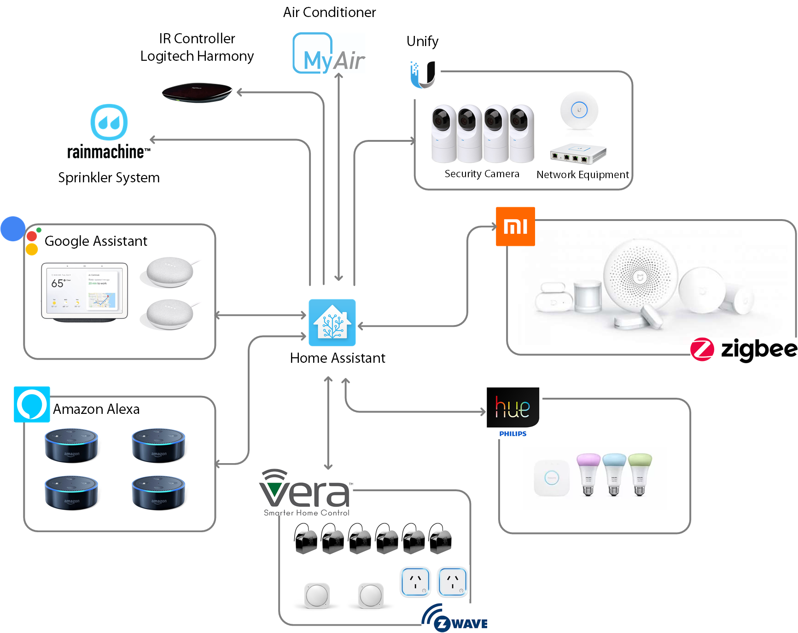
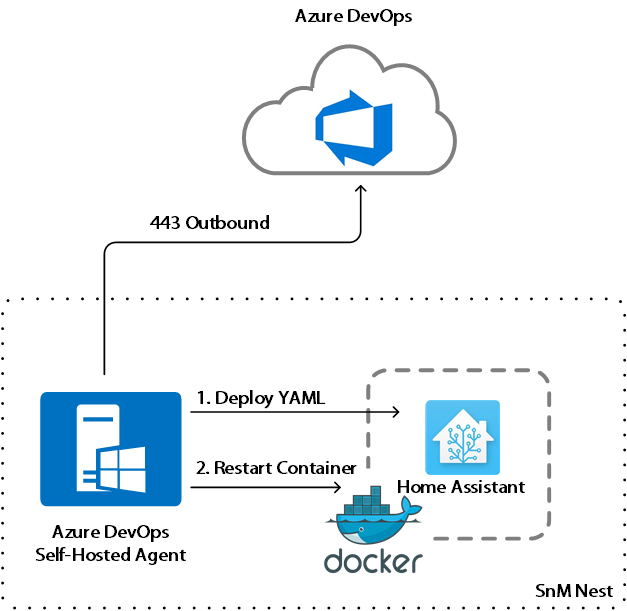
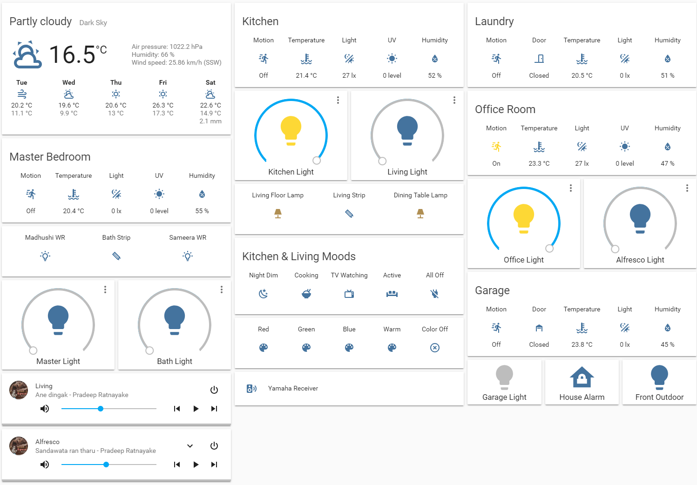
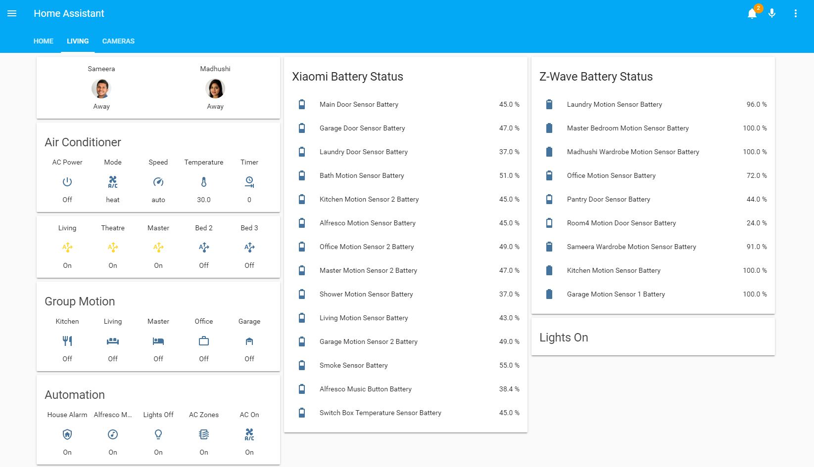
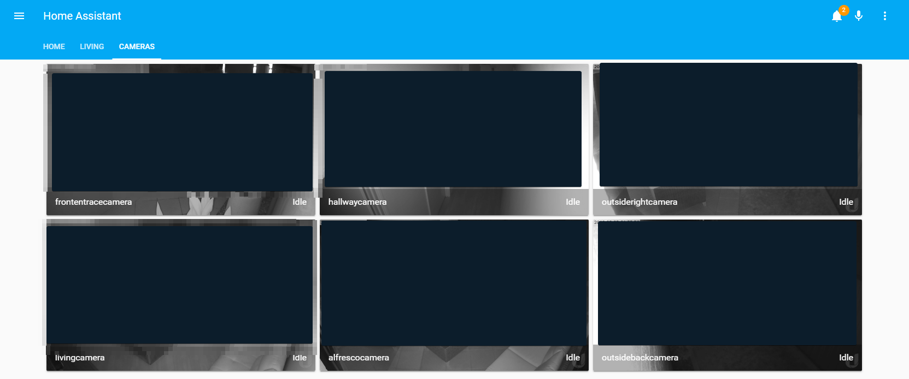

# Home Assistant At SnM Nest

This provides the yaml configuration used at SnM Nest Home Assistant. If you are interested in trying out Home Assistant please visit the web site [here](https://www.home-assistant.io/)

# Devices

- Hass.io running in Docker in a Ubuntu VM. Ubuntu VM is running a Hyper-V host. 
- Vera Edge for Z-Wave Control
- Xiaomi Gateway
- Philips Hue Bridge Gen 2
- Philips Lights
- Philips Light Strips
- Xiaomi Human Motion Sensors
- Xiaomi Door Sensors
- Xiaomi Temperature Sensor
- Xiaomi Buttons
- Xiaomi Plug
- Google Home Hubs
- Google Hub Minis
- Amazon Alexa 
- Logitech Harmony
- Advantage Air 
- Fibaro Dimmers
- AeoTec MultiSensor 6 Gen5
- AeoTec Smart Switch
- UniFi Network Switch
- UniFi Access Point - NanoHD
- UniFi Secure Gateway
- UniFi G3 Flex Camera
- Yamaha RX-V473
- Ring Doorbell
- Sonos Connect Amp
- Sonos Play:3

# CI/CD - DevOps

DevOps was implemented with Azure DevOps. Only continuous delivery is configured. Below diagram provides a high level overview of the configuration. For more details around the configuration please visit the [blog post](https://sameeraman.wordpress.com/2018/12/10/local-self-hosted-agents-in-azure-devops/). 

 

# Dashboards

Following are some of the Lovelace Dashboards I have created to control the smart home. 

# Automations

Following are some of the automation that I'm using at my smart home. 

## Air conditioner Automation

- Set Air conditioner stop timer to 90 mins when it is turned on
- Reset Air Conditioner Stop Timer to 0 when the air conditioner is turned off  
- Turn on the Air conditioner on Weekdays at 06:15AM if the kitchen temperature is below 19C
- Alert when Air conditioner is left on for more than 4 hours
- Alert when Air conditioner is left on for more than 6 hours
- Alert and Turn off air conditioner if it is left On when the house alarm is on (After leaving home)

## Bathroom Automations
- Turn on the Bath Light when there is motion
- Turn off the Bath Light when there's no Motion in shower and Bathroom
- Turn on the Bath strip when there is motion in Master bedroom
- Turn off the Bath strip when there's no Motion in master bedroom
- Alert every day at 10:00pm if any of the doors were left open

## Kitchen and Living Automations
- Turn on the Pantry Light when the door opens
- Turn off the pantry light when the door close
- Turn off the Pantry Light when the door open and left for more than 2 minutes
- Turn on the Kitchen light then there is motion
- Turn off the Kitchen Light when there is no motion for more than 10 minutes
- Turn on the living mood dim lights (light strips and lamps) when there is motion in kitchen/living and when time is between sunset and midnight
- Turn off the living mood dim lights at mid night
- Turn off the Living Sonos (if playing) when the TV is switched on
- Toggle Living Mood lights when Xiaomi Living push button is single pressed
- Toggle Living Sonos when Xiaomi Living push button is double pressed
- Alarm when there is motion outside master bedroom and when the night mood is on

## Garage Automation
- Turn on the garage light then there is motion
- Turn off the garage light then there is no motion
- Alert if the Garage door was left open for more than 10 minutes
- Alert if the Garage door was left open for more than 60 minutes
- Turn on the Front Outdoor light for 2 mins then there the garage door open

## Alfresco Automation
- Toggle Alfresco Sonos Music Play with Alfresco Xiaomi push button
- Jump to Next track in Alfresco Music Play when Alfresco Xiaomi push button double press is detected

## Office Automations
- Turn on the Office light then there is motion
- Turn off the Office Light when there is no motion 

## Master Bedroom Automations
- Turn off the Master Light when there is no motion for more than 5 minutes
- Turn off the Office AC Vent when there is no motion for more than 5 minutes in the office
- Turn On the Office AC Vent when there is motion for more than 3 minutes in the office

## Other Automations
- Send Alerts from Xiaomi Motion and Door sensors when the house is Armed
- Alert if the Laundry door was left open for more than 10 minutes
- Alert if the Laundry door was left open for more than 60 minutes
- Turn on house alarm based on device tracker - Arm when every one is out of the house
- Turn off house alarm based on device tracker - Unarm when anyone is back at home